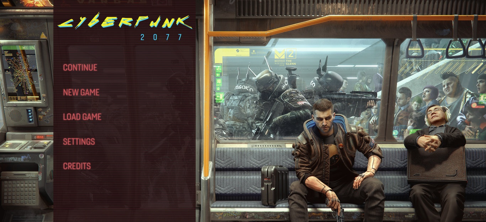

# Cyberpunk2077 InGame Menu

Foobar is a Python library for dealing with word pluralization.

## Installation

Use the package control version [git](https://git-scm.com/downloads).

```bash
git clone https://github.com/Victor1890/Cyberpunk-2077-InGame-Menu.git
```

```bash
cd Cyberpunk-2077-Ingame-Menu
```

## Fonts using in the project

1. [Cyberpunk2077](https://fontsrepo.com/cyberpunk-2077-free-font/)
2. [Gineso Soft](https://www.fonts.com/font/insigne/gineso-soft)


## Usage

Using VSCode, open the files `index.html` and `style.css`

```html
<div class="menu">
    <div class="logo">
    cyberpunk
        <div class="sublogo">2077</div>
    </div>

    <ul>
        <li>Continue</li>
        <li>New Game</li>
        <li>Load Game</li>
        <li>Settings</li>
        <li>Credits</li>
    </ul>
</div>
```

The file `font.css` is here where configured the fonts in the website

```css
/* Example */
@font-face{
    font-family: "Cyberpunk";
    src: url("../fonts/Cyberpunk.ttf"),url("../fonts/Cyberpunk.otf");
}
```
## Screenshot



## License
[MIT](https://choosealicense.com/licenses/mit/)